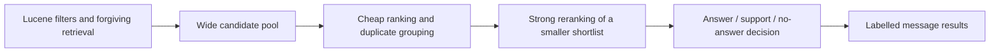

# Local ranking models and decision layers

This research supports the [combined-search design](https://github.com/leemour/cli-messaging/blob/feat/combined-search/docs/dev/combined-search.md) and
[evaluation notes](combined-search-evaluation.md). It proposes experiments rather than a public
model/default change. The current model is measured locally; alternative model sizes come from
publisher model cards and public Hub file metadata. Published GPU timings are not laptop CPU timings.

## Ways to use the candidate pool

The current dev pool contains 90 percent of labelled relevant messages at depth 300; every
non-paraphrase category has full candidate recall and paraphrases have zero. It does not mean that
90 percent of the 300 returned messages are relevant. Most are distractors. Candidate recall is a
coverage measure, not precision, and these pool measurements are on dev, not a claimed universal rate.

A proposed cascade keeps wide retrieval but spends expensive inference selectively:



The smaller shortlist must be chosen by an improved cheap stage, not merely by truncating the
current order: dev candidate recall drops from 0.90 at 300 to 0.4375 at 50. Measure actual-answer
and evidence recall before/after every stage. A separate candidate-generation experiment can
union lexical hits with semantic hits, including existing conversation chunks mapped back to
messages, while preserving authority and hard filters. This could address the paraphrase misses.
The e5 cosine result rejects it as our final reranker; it does not measure or rule out that
candidate-generation role. Noise and no-answer behavior must be evaluated for the full cascade. Grouping should suppress near-identical boilerplate
without discarding genuinely distinct evidence; simple chat caps alone did not improve this corpus.

Ranking asks which message is relatively better. An answerability decision asks whether the
requested fact is actually present. Keep those separate. A decision model could classify five to
ten finalists as direct answer, support, missing fact, contradictory/outdated, or needing thread
context. Include an explicit no-answer option; choosing among supplied candidates alone can force
an answer even when every candidate is poor. Thresholds need our own held-out calibration.

Useful candidates should retain matcher provenance, account/chat authority, corrected spellings
and model/version metadata. Returning only three hits does not itself remove the cost of scoring
300. Adaptive expansion or early stopping requires measured miss rates; a high score on an already
examined hit does not establish that unexamined messages contain no better answer.

## What Jev contributes

[TypeSafe's introduction](https://typesafe.ai/blog/introducing-system-one-models-and-jev) describes
shared-state typed decisions and non-autoregressive outputs, with vendor-reported 70–500 ms calls.
[The model documentation](https://docs.typesafe.ai/models) describes a hosted API with shared state
and parallel questions, a 64k combined input budget and a 32k state-plus-longest-question budget.
The introduction specifies up to 255 choice options. No public local weights or model size were
found in those official materials. These timings are not measurements on our 300-message workload.

Our current cross-encoder already emits a scalar without generating text. The interesting System
One features for this task are shared context, typed evidence decisions and uncertainty handling.
Valid output types do not establish factual correctness. A single forward pass still has to process
the supplied text; long lists can have substantial computation and memory costs.

Open alternatives with publisher-owned repositories:

- [Laya](https://github.com/NandhaKishorM/laya): Apache-2.0 typed decision models. Its multilingual
  checkpoint uses mmBERT-base, about 322M parameters, with an ONNX option and a TypeScript project.
  The multilingual default input limit is 1,024 tokens; the documented extension is 8,192. The
  advertised 33 ms figure is a GPU result, not our CPU latency.
- [Kev](https://github.com/jaredpalmer/kev): Apache-2.0 shared-state models based on Qwen, starting
  at 0.8B. [Kev-0.8B](https://huggingface.co/jaredpalmer/kev-0.8b) is English-only according to its
  model card. Its roughly 43 MB adapter also needs the approximately 1.75 GB BF16 base and a head.
  CUDA/MLX benchmarks do not establish performance on our Linux CPU.
- [CLM](https://github.com/Contrastive-LM/CLM): separately caches state/action representations and
  exposes direct candidate ranking. The reference uses a Qwen3-8B encoder plus projection heads;
  its small head download is not the complete model. This is a useful architecture reference,
  but the published reference is not a small CPU-first replacement.

For a Russian/English local decision experiment, Laya-multilingual is the more appropriate first
candidate than Kev-0.8B. This is a suitability judgment from declared language, footprint and
interface, not a benchmark result proving superior search quality.

## Ranking model shortlist

Sizes below are selected weight files, decimal MB/GB, excluding tokenizer/config/runtime unless
explicitly stated. Only the current model's RAM has been measured. Quantization may affect ranking
and must be evaluated; different models' scores or thresholds are not interchangeable.

| Model | Published footprint | Proposed role and constraints |
|---|---|---|
| Current multilingual mMARCO MiniLMv2 | 118.6 MB int8 ONNX; 135.7 MB with tokenizer/config | Controlled baseline; first test native and batched execution |
| [TinyBERT-L2](https://huggingface.co/cross-encoder/ms-marco-TinyBERT-L2-v2) | 4.4M parameters; 4.52 MB int8 ONNX | Very small English speed control; older model, not a multilingual replacement |
| [MiniLM-L6](https://huggingface.co/cross-encoder/ms-marco-MiniLM-L6-v2) | 22.7M; 23.2 MB int8 ONNX | English CPU baseline between TinyBERT and the current multilingual model |
| [GTE multilingual reranker](https://huggingface.co/Alibaba-NLP/gte-multilingual-reranker-base) | About 306M; 612 MB FP16 | Apache-2.0 encoder-only reranker covering Russian and 70+ languages; CPU serving is documented |
| [Qwen3-Reranker-0.6B](https://huggingface.co/Qwen/Qwen3-Reranker-0.6B) | 596M; 1.19 GB BF16 | Apache-2.0 multilingual, instruction-conditioned quality comparator; bigger does not establish faster CPU inference |
| [Jina reranker v3.5](https://huggingface.co/jinaai/jina-reranker-v3.5) | 597M; 1.19 GB BF16; official Q4 GGUF about 397 MB plus projector | Modern multilingual listwise ranking; published speed improvements use A100/FlashAttention; CC BY-NC 4.0 limits default commercial adoption |
| [Laya-multilingual](https://huggingface.co/convaiinnovations/laya-multilingual) | 322M; 644 MB safetensors | Apache-2.0 typed finalist/answerability experiment, not a tested drop-in reranker |
| [Answer.AI ColBERT small](https://huggingface.co/answerdotai/answerai-colbert-small-v1) | 33.4M; about 34 MB int8 ONNX | English late-interaction architecture control with reusable message representations |

[Mixedbread xsmall](https://huggingface.co/mixedbread-ai/mxbai-rerank-xsmall-v1) is another compact
English comparator: 70.8M parameters, about 87 MB quantized ONNX. The
[FlashRank project](https://github.com/PrithivirajDamodaran/FlashRank) demonstrates CPU use of small
ONNX rerankers; its tiny model is the TinyBERT family, not evidence that every multilingual model
can fit in 4 MB.

[GLiNER2.5](https://github.com/fastino-ai/GLiNER2) is an additional typed classification/extraction
route: 74M small English and 287M multilingual checkpoints. It could supply evidence-role features,
but its declared task is extraction/classification; message relevance and answerability need validation.

## Listwise and late-interaction alternatives

Jina v3.5 jointly ranks lists and shares query/context computation; it is architecturally different
from 300 independent pair passes. Its model card reports 1.22–1.56x improvements over v3 on A100,
not a measured speedup over our model or on our CPU. Evaluate document-order sensitivity, list
length, batch merging and RAM; raw scores can depend on the surrounding candidate list. Its
noncommercial weight license makes it a research comparator rather than the default permissive option.

ColBERT-style **late interaction** precomputes token-level message representations. A new query is
encoded once; MaxSim matches its token vectors against stored message vectors. This shifts neural
message encoding into archive preparation and can avoid online neural inference for every pair.
It adds index storage, freshness/permission handling and build costs. It is different from the
single-vector e5 cosine experiment, so e5's failure does not rule it out.

[ModernColBERT](https://huggingface.co/lightonai/GTE-ModernColBERT-v1) is an Apache-2.0 English example,
about 149M parameters and a 150 MB int8 export.
[Liquid LFM2.5-ColBERT-350M](https://huggingface.co/LiquidAI/LFM2.5-ColBERT-350M) is a newer efficient
multilingual example with about 353M parameters, but its eleven declared languages omit Russian,
and its license is the LFM Open License. Neither should silently become the Russian default.
A suitable multilingual checkpoint and its index costs need separate evaluation.

## Current measured disk, RAM and preparation

[resources.ts](message-search/resources.ts) loads the existing pinned model in
an isolated Node process and scores 300 short synthetic messages; no store/account is opened.
[resources.json](message-search/resources.json) records the model pins, whole-
process RSS at each stage, high-water resident memory, model load and inference times.

The measured process starts at about 70 MB RSS, uses about 1.06 GB after load and peaks at about
1.33 GB. Scoring 300 short pairs takes about 3.25 seconds; load takes about 1.27 seconds. These are
lab observations for this runtime and workload, not a model-only allocation breakdown or an upper
bound for larger contexts/batches. The resident footprint includes tokenizer objects, ONNX engine,
weights, worker state and intermediate buffers; disk weight size alone does not predict RAM.

Reproduce after explicit model preparation:

```sh
MESSAGE_RERANKER_DIR=/tmp/message-search-reranker-1427fd6 \
  python3 performance/search/run.py --messaging-root "$SEARCH_MESSAGING_ROOT" resources > /tmp/search-new-resources.json
```

The existing [preparation script](message-search/prepare-reranker.py) downloads
only the four pinned files in [the manifest](message-search/reranker.json),
verifies SHA-256, writes partial downloads separately, and reuses verified files. It does not clone
all precision variants from the model repository. The offline benchmark never installs a model.
A production model category and explicit installer remain future work.

Download time depends on transfer rate. For the complete 135.7 MB set, transfer-only estimates
are about 109 seconds at 10 Mbit/s, 54 seconds at 20 Mbit/s and 11 seconds at 100 Mbit/s. Add network
setup, server delays and verification. The original download was not timed. A 1.2 GB checkpoint
would take about eight minutes at 20 Mbit/s before that overhead. RAM for alternative models is
unmeasured; checkpoint precision, runtime, input length, batching and accelerator placement matter.

## Recommended experiment order

1. Compare the current weights under native CPU execution and length-grouped batches, with ranking
   equivalence, memory and cold/warm latency checks. This isolates implementation cost from model quality.
2. Add a tiny English control and one permissively licensed multilingual reranker, then evaluate a
   fast-to-strong cascade. Keep the 300-message retrieval pool until shortlist recall proves equivalent.
3. Test Laya-multilingual on a few finalists for actual answer/support/none and context-needed decisions.
   Measure answer-only success, false hits, calibration and the extra end-to-end latency.
4. Investigate a multilingual late-interaction index if recurrent online pair inference remains too costly.
   Jina listwise ranking is a useful separately licensed architecture comparator.

No new alternative weights were installed, no hosted Jev call was made, and no public search behavior
changed during this research. Future selection uses fresh held-out families rather than retuning
against the already exposed keyword/question results.
